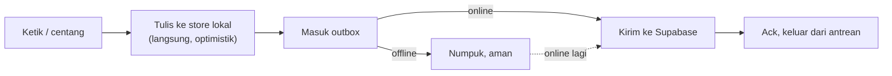
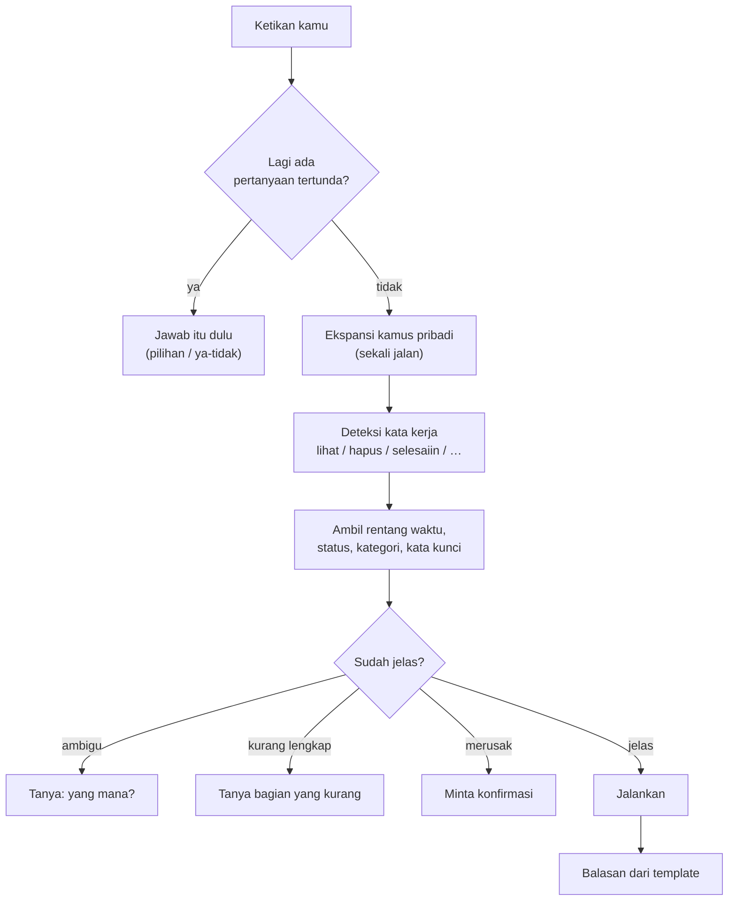

<div align="center">

# HaKaiTask

**Task manager berbahasa Indonesia yang kamu ajak ngobrol — tanpa AI sama sekali.**

Ketik `jadwalin rapat sama klien rabu jam 3` dan langsung jadi.
Bukan karena ada model bahasa yang nebak, tapi karena ada kamus yang bisa kamu baca,
kamu betulkan, dan jalan tanpa internet.

[](https://www.typescriptlang.org/)
[](https://react.dev/)
[](https://vite.dev/)
[](https://supabase.com/)
[](#2-kenapa-tanpa-ai)
[](#3-offline-first-yang-beneran)

</div>

---

## Sekilas

```
Selamat malam, Kai. Agenda kamu berikutnya Sen 10 Agu 09:00: Standup.
Ada yang bisa dibantu?

> jadwalin rapat sama klien rabu jam 3
  Oke — "Rapat sama klien", Rab 12 Agu 15:00.

> apa aja agenda gw rabu?
  Ada 2 agenda Rabu:
  • Rab 12 Agu 09:00 — Standup
  • Rab 12 Agu 15:00 — Rapat sama klien

> rabu jam 4 gw kosong ga?
  Rabu jam 16.00 kamu kosong, gak ada agenda di waktu itu.

> selesaiin rapat
  "Rapat sama klien" ditandai selesai.

> ok makasih
  Sama-sama.
```

Kalimat terakhir itu penting: **basa-basi gak nyangkut jadi data.** Banyak app
begini yang diam-diam bikin task berjudul "Makasih".

---

## Daftar isi

| | |
|---|---|
| [Masalah yang dipecahkan](#masalah-yang-dipecahkan) | Enam situasi nyata yang bikin app ini ada |
| [Dibanding app sejenis](#dibanding-app-sejenis) | Kenapa ini, bukan Todoist / TickTick / Notion |
| [Kenapa pakai ini](#kenapa-pakai-ini) | Empat alasan yang bukan basa-basi |
| [Fitur](#fitur) | Apa aja yang bisa dilakukan |
| [Contekan perintah](#contekan-perintah) | Tabel lengkap semua perintah |
| [Kamus pribadi](#kamus-pribadi) | Ngajarin istilah kamu sendiri |
| [Mulai pakai](#mulai-pakai) | Jalanin di komputer sendiri |
| [Cara kerjanya](#cara-kerjanya) | Arsitektur & alur data |
| [Catatan lapangan](#catatan-lapangan) | Bug nyata & aturan yang lahir darinya |
| [Status](#status-apa-yang-udah-jadi) | Yang udah jadi vs belum |

---

## Masalah yang dipecahkan

Bukan "task manager kurang satu lagi". Ini enam situasi yang bikin app ini ada.

### 1. Ide datang pas tangan lagi penuh

> **Situasi.** Kamu lagi di angkot. Dosen barusan nyebut deadline. Atau kamu baru
> keluar dari ruang meeting sambil jalan.
>
> **Yang biasanya terjadi.** Buka app → tombol `+` → ketik judul → buka pemilih
> tanggal → gulir bulan → pilih tanggal → buka pemilih jam → pilih jam → simpan.
> Delapan ketukan, belasan detik, dan dua tangan. Kalau lagi buru-buru,
> **gak jadi dicatat.** Yang gak dicatat, dilupain.
>
> **Di sini.** Satu kalimat, satu Enter, di bawah lima detik:
> `ingetin bayar ukt jumat jam 9`

Ini masalah paling mendasarnya. Task manager gagal bukan karena fiturnya kurang,
tapi karena **biaya nyatatnya lebih mahal daripada risiko lupa** — jadi kamu
milih lupa.

### 2. Kamu harus mikir dua kali

> **Situasi.** Di kepala kamu sudah utuh: *"lusa sore ngopi sama Arko"*.
>
> **Yang biasanya terjadi.** Kalimat itu harus kamu bongkar sendiri jadi
> potongan-potongan yang dimengerti app: judul di sini, tanggal di kalender,
> jam di dropdown. Kamu mikir sekali buat isinya, lalu mikir lagi buat
> menerjemahkannya.
>
> **Di sini.** Tulis persis seperti yang kamu pikirkan. Yang menerjemahkan
> app-nya, bukan kamu.

Beban tiap kejadiannya kecil — dua detik, sedikit gesekan. Tapi dikali sepuluh
kali sehari, itu yang bikin orang berhenti pakai.

### 3. Sinyal hilang tepat di momen paling sering dipakai

> **Situasi.** Lift, basement parkir, angkot, kampus jam sibuk, atau kuota habis
> di tanggal tua.
>
> **Yang biasanya terjadi.** Aplikasi berbasis web muter-muter, centang gak
> masuk, atau yang kamu ketik hilang waktu halaman dimuat ulang.
>
> **Di sini.** Nyentang dan nambah task **gak pernah** nunggu jaringan. Semuanya
> ditulis lokal dulu; sinkronisasi nyusul sendiri begitu online. Kalau kamu edit
> di HP dan di laptop sekaligus, dua-duanya selamat — konfliknya diselesaikan
> per field, bukan per baris.

### 4. Daftar 40 task bikin lumpuh, bukan produktif

> **Situasi.** Kamu buka app buat mulai kerja, terus lihat 40 baris.
>
> **Yang biasanya terjadi.** Lima menit habis buat mutusin mau mulai dari mana,
> dan kamu keluar tanpa ngerjain apa pun.
>
> **Di sini.** Dashboard menjawab **"apa sekarang?"**, bukan "apa aja yang ada?".
> Satu Focus Card, dipilih otomatis dari gabungan tenggat, prioritas, dan energi
> waktu itu. Sisanya diringkas jadi "Berikutnya".

### 5. "Besok jam 3 gue bisa gak, ya?"

> **Situasi.** Ada yang ngajak ketemu, dan kamu harus jawab sekarang.
>
> **Yang biasanya terjadi.** Buka kalender, cari tanggalnya, gulir ke jam 3,
> pindai satu-satu, baru jawab. Sambil ngobrol, sambil diliatin.
>
> **Di sini.** `besok jam 3 gw kosong ga?` — dijawab langsung, sekalian disebut
> agenda yang bentrok kalau ada. Task tanpa jam gak dianggap bikin kamu sibuk
> seharian.

### 6. Bahasa kamu bukan bahasa app

> **Situasi.** Kamu nyebutnya "dismath", "responsi", "clientan", "kondangan",
> "ngelab". Bukan "Discrete Mathematics — Lecture".
>
> **Yang biasanya terjadi.** Kamu yang menyesuaikan diri: bikin label, bikin
> filter tersimpan, atau nulis panjang tiap kali biar app-nya ngerti.
>
> **Di sini.** Ajarin sekali, dipakai selamanya:
> `kalau gw bilang clientan, maksudnya meeting client`
>
> Bukan model yang menebak — satu baris pemetaan yang bisa kamu baca, ubah, dan
> hapus kapan pun.

<details>
<summary><b>Dan satu lagi: jadwal itu urusan pribadi</b></summary>

<br>

Isi task kamu bukan data netral. Di situ ada nama klien, jadwal kontrol ke
dokter, urusan keluarga, deadline yang belum kamu kasih tau siapa-siapa.

Karena parsingnya gak pakai AI, **kalimat kamu gak pernah dikirim ke server siapa
pun buat "dimengerti"**. Yang tersimpan cuma hasil akhirnya, di database Supabase
milik kamu sendiri, dilindungi Row Level Security. Bukan janji kebijakan privasi
— memang gak ada jalur teknisnya buat keluar.

</details>

---

## Dibanding app sejenis

Jangan percaya klaim di README. **Buka app to-do yang kamu pakai sekarang, coba
empat hal ini.**

### Tes 1 — ketik kalimat Indonesia apa adanya

```
lusa jam 3an ngopi sama arko
```

Di kebanyakan app, seluruh kalimat itu jadi **judul task**, dan tanggalnya
gak kebaca. Bukan karena app-nya jelek — parsing bahasa alaminya memang dibikin
buat bahasa Inggris. `next tuesday 3pm` jalan mulus; `lusa jam 3an` enggak.

Di HaKaiTask: judul **Ngopi sama arko**, tanggal **lusa**, jam **15:00**,
ditandai perkiraan karena kamu nulis "3an".

### Tes 2 — ajarin dia istilah kamu sendiri

Kamu bilang "clientan" buat meeting sama klien. Coba ajarin app-mu.

Hampir pasti gak bisa. Yang ada cuma label, tag, atau filter tersimpan — kamu
tetap harus ngomong pakai bahasa app-nya. HaKaiTask kebalikannya: **app-nya yang
belajar bahasa kamu**, sekali ketik, permanen, dan bisa kamu baca ulang kapan pun
sebagai satu baris `clientan → meeting client`.

### Tes 3 — matiin internet, terus pakai

Centang 5 task, tambah 2, hapus 1. Ada yang gagal? Ada yang muncul lagi setelah
online? Di HaKaiTask, nulis **gak pernah** nunggu jaringan — semua masuk lokal
dulu, antrean sync nyusul, dan konflik diselesaikan per field jadi editan dari
dua device gak saling makan.

### Tes 4 — kalau dia salah baca, kamu bisa betulin?

Ini yang paling menentukan. Di app ber-AI atau parser tertutup, salah baca cuma
bisa dilaporkan lalu ditunggu. Di sini kamusnya **file JSON biasa** — nambah satu
baris, dan salahnya hilang selamanya di semua device kamu.

<details>
<summary><b>Ringkasnya dalam tabel</b></summary>

<br>

| | HaKaiTask | App to-do pada umumnya |
|---|---|---|
| Input bahasa Indonesia sehari-hari | Inti produknya | Umumnya jadi judul polos |
| Slang & singkatan pribadi | Bisa diajarin, permanen | Gak ada konsepnya |
| Kalau salah baca | Tambah 1 baris kamus | Lapor, lalu tunggu |
| Offline | Jalan penuh, nulis gak nunggu jaringan | Bervariasi |
| Datanya di mana | Database Supabase milik kamu | Server penyedia |
| Biaya | Nol (tier gratis cukup) | Sering ada fitur berbayar |
| Kecepatan paham kalimat | < 5 md, di device | Tergantung server kalau pakai AI |

</details>

### Kapan **jangan** pakai ini

Bagian ini yang bikin bagian di atas layak dipercaya.

| Kalau kamu… | Pakai yang lain |
|---|---|
| Butuh **notifikasi/pengingat** yang bunyi | Belum ada di sini. Ini pemakaian paling umum, dan HaKaiTask belum bisa |
| Kerja **bareng tim**, bagi-bagi task | Gak ada fitur kolaborasi sama sekali |
| Butuh **app mobile native** | Belum ada; web-nya jalan di HP tapi belum bisa di-install |
| Mau **integrasi** Google Calendar, email, Slack | Sengaja dibuang demi satu sumber kebenaran |
| Gak nyaman **ngetik**, lebih suka klik-klik | Hampir semua di sini lewat mengetik |
| Butuh **dukungan resmi** & jaminan uptime | Ini proyek pribadi |

Intinya: HaKaiTask menang kalau kamu orang Indonesia yang mikirnya cepat, ngetik
cepat, dan kesal harus menerjemahkan pikiran sendiri jadi formulir. Di luar itu,
app lain kemungkinan lebih cocok — dan itu wajar.

---

## Kenapa pakai ini

### 1. Ngerti bahasa kamu, bukan bahasa formulir

Kebanyakan task manager minta kamu isi formulir: judul, tanggal, jam, prioritas,
label. HaKaiTask cukup dikasih satu kalimat.

```
revisi vlog besok jam 2 !p1 #konten 90m
```

→ judul **Revisi vlog**, jatuh tempo **besok 14:00**, prioritas **P1**,
label **#konten**, estimasi **90 menit**. Satu baris, sekali Enter.

<details>
<summary><b>Yang dimengerti parser</b> (klik buat lihat)</summary>

<br>

| Kategori | Contoh yang dimengerti |
|---|---|
| Tanggal relatif | `hari ini`, `besok`, `lusa`, `kemarin`, `3 hari lagi`, `dalam 2 minggu` |
| Nama hari | `senin`, `senin depan`, `senin ini`, `hari jumat` |
| Rentang | `minggu ini`, `minggu depan`, `bulan ini`, `bulan depan` |
| Tanggal pasti | `25 des`, `tanggal 25`, `25/12`, `25/12/2027` |
| Jam | `jam 3`, `jam 14:30`, `setengah 3`, `jam 3 lewat 15`, `jam 2 sampai 4` |
| Bagian hari | `pagi`, `siang`, `sore`, `malam`, `subuh`, `dini hari` |
| Perkiraan | `jam 3an`, `sekitar jam 3` |
| Durasi | `90 menit`, `2 jam`, `90m`, `1.5j`, `sebentar`, `setengah jam` |
| Pengulangan | `tiap hari`, `tiap hari kerja`, `tiap senin rabu jumat`, `tiap 2 minggu`, `tiap tanggal 25` |

Jam yang ambigu diselesaikan dengan aturan tetap: **`jam 3` = 15:00**,
**`jam 9` = 09:00**. Kalau kamu sebut `pagi`/`malam`, itu yang menang.

Kamusnya berisi **~1.900 entri**: sinonim formal, bentuk sehari-hari, singkatan
(`bsk`, `tggl`, `jm`), dan salah ketik yang umum (`pagii`, `kmrin`, `malem`).
Jadi `tolong catat fisioterapi bsk pagii` kebaca utuh — judul, tanggal, jam.

Ada juga **audit otomatis**: tiap entri di kamus diuji benar-benar berpengaruh.
Ini bukan formalitas — `"penting banget"` pernah nyangkut jadi entri mati karena
kata `banget` sudah dibuang di tahap yang jalan lebih dulu, jadi frasa itu tidak
akan pernah cocok. Audit itu yang menemukannya.

</details>

<details>
<summary><b>Token bertanda</b> — buat yang suka cepat</summary>

<br>

| Tanda | Arti | Contoh |
|---|---|---|
| `!` | Prioritas | `!p1` `!p2` `!!` (= P1) `!` (= P2) |
| `#` | Label | `#konten` `#kuliah` |
| `@` | Proyek | `@kerja` `@skripsi` |
| `~` | Energi | `~berat` `~ringan` |
| `*` | Pengingat | `*30m` `*2jam` |
| `+` | Sub-task | `+riset +tulis draf` |
| `//` | Catatan | `beli kopi // yang arabica` |
| `" "` | Kunci teks | `"jam 5"` biar gak dibaca sebagai waktu |

</details>

### 2. Kenapa tanpa AI

Ini keputusan sadar, bukan keterbatasan. Alasannya ditulis lengkap di
[`PLAN.md` §11.2](PLAN.md), ringkasnya:

| | Parser kamus (dipakai) | Parsing pakai LLM (ditolak) |
|---|---|---|
| **Kecepatan** | < 5 milidetik | 1–3 detik |
| **Offline** | Jalan penuh | Mati total |
| **Kalau salah** | Tambah 1 baris kamus, benar selamanya | Nunggu vendor |
| **Bisa diperiksa** | Ya, kamusnya file JSON biasa | Tidak |
| **Biaya** | Nol | Per panggilan, selamanya |
| **Data kamu** | Gak pernah keluar device | Dikirim ke server orang |

Yang direlakan: kalimat di luar kamus masuk sebagai judul polos tanpa tanggal.
Itu **kegagalan yang kelihatan** — kamu langsung sadar dan bisa koreksi.
Bandingkan dengan AI yang nebak tanggal salah dengan penuh percaya diri: itu
kegagalan yang senyap, dan baru ketahuan pas kamu telat.

### 3. Offline-first yang beneran

Bukan "offline-first" tempelan. Nyentang task **gak pernah** nunggu jaringan.



- Semua perubahan **ditulis lokal dulu**, antrean sync nyusul sendiri.
- Konflik diselesaikan **last-write-wins per field**, bukan per baris — edit
  judul di HP dan jam di laptop dua-duanya selamat.
- Hapus pakai **tombstone**, jadi yang dihapus di HP gak "hidup lagi" dari cache laptop.
- Kalau kirim gagal terus, statusnya kelihatan dan bisa dicoba ulang — bukan hilang diam-diam.

### 4. Kamusnya tumbuh ikut kamu

Punya istilah sendiri? Ajarin sekali, kepakai selamanya. Tanpa training, tanpa
model, tanpa data kamu ke mana-mana. Lihat [Kamus pribadi](#kamus-pribadi).

---

## Fitur

<details open>
<summary><b>Chat — halaman utama</b></summary>

<br>

Bukan asisten, tapi **baris perintah yang ramah**. Semua kalimat balasan ditulis
manusia dan tersimpan sebagai template — tidak ada teks yang dihasilkan model.

- Bikin, lihat, cari, ubah jadwal, centang selesai, hapus
- Cek waktu kosong: `besok jam 3 gw kosong ga?`
- Semua operasi menghapus **wajib konfirmasi**, lengkap dengan daftar apa yang kena
- Salah hapus? Ketik `batal` — kembali lagi
- Kalau ada dua yang cocok, sistem **gak milih sendiri**; dia nanya

</details>

<details>
<summary><b>Sistem gak pernah nebak kalau ragu</b></summary>

<br>

Aturan yang dipegang: **kalau ragu, pilih baca.** Salah-baca cuma bikin daftar
yang gak kepake; salah-tulis bikin data kotor yang harus kamu bersihin.

```
> ubah meeting gw besok
  Ada 2 meeting besok. Yang mana?
  1. 10:00 — Meeting Client A
  2. 15:00 — Meeting Internal

> yang nomor 1
  "Meeting Client A" mau dipindah ke kapan?

> jam 4
  "Meeting Client A" dipindah ke Sab 8 Agu 16:00.
```

Perhatikan: perintah awalnya **gak lengkap**, tapi sistem gak nolak seluruh
kalimat. Dia simpan niatnya dan minta bagian yang kurang.

</details>

<details>
<summary><b>Dashboard — satu fokus, bukan daftar panjang</b></summary>

<br>

Menjawab **"apa sekarang?"**, bukan "apa aja yang ada?".

- **Focus Card**: satu task terpilih otomatis dari skor gabungan tenggat,
  prioritas, dan energi
- **Berikutnya**: agenda terdekat, ringkas
- Tanpa sapaan, tanpa basa-basi — dashboard itu alat

</details>

<details>
<summary><b>Kalender</b></summary>

<br>

- Grid bulanan; tiap hari punya titik penanda kepadatan (merah kalau ada yang lewat tenggat)
- Klik tanggal → daftar agenda hari itu
- Tombol **+ Tambah** membawa tanggal yang dipilih ke chat, jadi kamu tinggal
  nulis judulnya

</details>

<details>
<summary><b>Sinkronisasi lintas perangkat</b></summary>

<br>

- Masuk pakai **magic link** (email) atau **Google**
- Task, jadwal, dan kamus pribadi ikut tersinkron
- Perubahan dari perangkat lain masuk **realtime**
- Indikator sync cuma muncul kalau ada yang perlu kamu tahu — diam kalau semua aman

</details>

<details>
<summary><b>Lain-lain</b></summary>

<br>

- **Mode terang & gelap**, ikut setelan sistem
- **Ctrl/Cmd + K** — command palette; cari task, pindah halaman, ganti tema
- **n** — langsung ke chat buat nulis
- Antarmuka Indonesia sepenuhnya, termasuk pesan error

</details>

---

## Contekan perintah

> Semua contoh di bawah **beneran jalan** — diambil dari kamus perintah yang dipakai kode.

<details open>
<summary><b>Nambah</b></summary>

<br>

| Kamu ketik | Hasilnya |
|---|---|
| `tambahin bikin laporan besok jam 9` | Task besok 09:00 |
| `jadwalin rapat sama klien rabu jam 3` | Task Rabu 15:00 |
| `ingetin bayar listrik tanggal 25` | Task tgl 25 + penanda pengingat |
| `olahraga tiap senin rabu jumat` | Task berulang |
| `revisi vlog besok jam 2 !p1 #konten 90m` | Lengkap dengan prioritas, label, estimasi |

**Aba-aba itu wajib.** Bikin task cuma otomatis kalau ada kata perintah
(`tambahin`, `jadwalin`, `ingetin`, …) **atau** ada waktu (`besok jam 9`).
Selain itu sistem nanya dulu:

```
> beli kopi
  Mau gue simpen "Beli kopi" jadi task? (ya / batal)
```

Sengaja begitu — bikin task itu perubahan data, dan itu gak boleh kejadian cuma
gara-gara kamu ngetik sesuatu yang mirip judul.

</details>

<details>
<summary><b>Lihat & cari</b></summary>

<br>

| Kamu ketik | Hasilnya |
|---|---|
| `apa aja agenda gw hari ini?` | Semua isi hari ini |
| `tampilin task besok` | Agenda besok |
| `jadwal gw minggu depan` | Rentang sepekan |
| `tampilin task yang belum selesai` | Filter status |
| `tampilin task yang udah selesai` | Yang sudah dicentang |
| `tampilin task yang telat` | Lewat tenggat & belum selesai |
| `tampilin semua rapat gw` | Semua yang masuk kategori rapat |
| `tampilin agenda zoom gw` | Cuma yang Zoom |
| `tampilin semua jadwal gw` | Termasuk yang sudah lewat |

**Task dan jadwal itu satu hal yang sama.** Kata `task`, `jadwal`, dan `agenda`
semuanya nyari hal yang sama — kamu gak perlu ingat sesuatu itu "dulu dibikin
pakai kata apa".

Kategori yang dikenal: `rapat`, `kuliah`, `olahraga`, `medis`, `sosial`.

</details>

<details>
<summary><b>Ubah, selesaikan, hapus</b></summary>

<br>

| Kamu ketik | Hasilnya |
|---|---|
| `selesaiin laporan` | Tandai selesai |
| `kelarin task laporan` | Sama |
| `batalin selesai laporan` | Balikin jadi belum selesai |
| `ubah task laporan jadi jam 9` | Ganti jam |
| `pindahin rapat senin ke selasa` | Pindah hari |
| `hapus meeting besok` | Hapus (dengan konfirmasi) |
| `hapus semua meeting minggu ini` | Massal (konfirmasi + daftar lengkap) |
| `batal` | Batalkan, atau kembalikan yang baru dihapus |

</details>

<details>
<summary><b>Cek waktu kosong</b></summary>

<br>

| Kamu ketik | Hasilnya |
|---|---|
| `besok jam 3 gw kosong ga?` | Kosong / sebut agenda yang bentrok |
| `hari ini sore gw luang ga?` | Cek per bagian hari |

Task tanpa jam (all-day) **tidak** dianggap menutup slot — punya tenggat besok
bukan berarti kamu sibuk seharian.

</details>

<details>
<summary><b>Bantuan</b></summary>

<br>

Ketik `bisa apa aja` atau `bantuan` — muncul daftar kemampuan lengkap dengan
contoh yang bisa langsung diketuk.

</details>

---

## Kamus pribadi

Punya istilah sendiri yang gak dikenal sistem? Ajarin.

```
> besok gw ada clientan gak?
  Gue belum ngerti "clientan", jadi belum nemu apa-apa besok.
  Mau kasih tau artinya?   [ ajarin "clientan" ]  [ gak usah ]

> ajarin "clientan"
  Oke. Kalau kamu bilang "clientan", artinya apa?

> meeting client
  Simpan ini?

    clientan  →  meeting client

    Contoh: "besok ada clientan gak?"
          → lihat agenda besok yang judulnya mengandung "meeting client"

    (ya / batal)

> ya
  Sip. Mulai sekarang "clientan" = meeting client.
```

Setelah itu, `clientan` langsung kepakai di perintah apa pun.

<details>
<summary><b>Cara kerjanya — dan kenapa ini bukan "AI belajar"</b></summary>

<br>

Kamus pribadi itu **makro teks**, bukan mesin aturan. Dia jalan sebelum parser
dan gak pernah ngajarin parser hal baru — dia cuma **menulis ulang kalimat kamu
jadi kalimat yang parser sudah mengerti.**

| | |
|---|---|
| **Sumber arti** | Ditulis kamu, harfiah — sistem gak pernah nyimpulin sendiri |
| **Bisa diperiksa** | Ya, satu baris: `clientan → meeting client` |
| **Bisa dibetulkan** | Edit sekali, benar selamanya |
| **Ekspansi** | Sekali jalan, tidak rekursif — siklus mustahil terjadi |
| **Privasi** | Berhenti di baris database milik kamu sendiri |

**Pengaman yang dipasang:**

- Kata perintah bawaan (`hapus`, `batal`, `ya`, `ajarin`) **tidak bisa** ditimpa —
  kalau bisa, kamu bakal terkunci di dalam percakapan sendiri
- Kata waktu (`besok`, `senin`, `jam`) juga dikunci — salah waktu itu kegagalan
  paling mahal
- Kalau istilahmu menimpa kata bawaan, kamu **diperingatkan dengan contoh kalimat
  nyata**, bukan istilah teknis
- Arti yang menghapus data dapat peringatan tegas, dan tetap minta konfirmasi tiap dipakai

**Mengelola:**

| Perintah | Hasil |
|---|---|
| `tampilin vocabulary gw` | Lihat semua istilah |
| `hapus vocabulary clientan` | Hapus satu |
| `kalau gw bilang X, maksudnya Y` | Ajarin langsung, tanpa dipandu |

</details>

---

## Mulai pakai

### Yang dibutuhkan

- **Node.js** ≥ 20
- **pnpm** 11 (`corepack enable` sudah cukup)
- Akun **Supabase** gratis (opsional — tanpa ini app tetap jalan penuh, cuma lokal)

### Jalanin

```bash
git clone https://github.com/k41ts/hakaitask.git
cd hakaitask
pnpm install
pnpm dev
```

Buka `http://localhost:5173`. **Tanpa setup Supabase pun app langsung jalan** —
semua fitur lokal hidup, cuma tidak ada sinkronisasi antar perangkat.

<details>
<summary><b>Nyalain sinkronisasi (opsional)</b></summary>

<br>

1. Bikin project di [supabase.com](https://supabase.com)
2. Jalankan migrasi di `supabase/migrations/` secara berurutan lewat SQL Editor
3. Salin `.env.example` jadi `.env.local`, isi dua nilai ini:

```env
VITE_SUPABASE_URL=https://<project-ref>.supabase.co
VITE_SUPABASE_PUBLISHABLE_KEY=sb_publishable_xxxxxxxxxxxxxxxx
```

Kunci *publishable* memang aman dipajang di client — datamu dijaga
**Row Level Security**, bukan oleh kerahasiaan kunci. Jangan pernah menaruh
`service_role` key di sini.

</details>

### Perintah lain

| Perintah | Fungsi |
|---|---|
| `pnpm dev` | Server pengembangan |
| `pnpm build` | Build produksi |
| `pnpm test` | Jalankan semua tes (312) |
| `pnpm typecheck` | Periksa tipe seluruh workspace |

---

## Cara kerjanya

### Alur satu giliran chat



Yang bikin ini bisa dipercaya: **mesinnya murni**. `chatTurn()` tidak menyentuh
database, tidak memanggil jaringan, bahkan tidak membuat ID. Dia membaca keadaan
lalu mengembalikan **deskripsi** perubahan; lapisan aplikasi yang menjalankannya.

Akibatnya seluruh perilaku chat bisa diuji tanpa React, tanpa browser, tanpa
jaringan — dan semua penulisan tetap lewat satu pintu, jadi tidak ada jalur yang
bisa lolos dari offline-first.

### Struktur repo

```
hakaitask/
├─ apps/web/              React + Vite + Tailwind v4
│  ├─ components/         ChatView, CalendarView, Dashboard, …
│  └─ lib/                sync, mapping, chat bridge, tema
├─ packages/
│  ├─ core/               TypeScript murni — TANPA React/DOM
│  │  ├─ parser/          Parser bahasa alami + kamus (lexicon.id.json)
│  │  ├─ chat/            Mesin chat: intent, rentang, query, kamus pribadi
│  │  ├─ store/           State Zustand + outbox
│  │  └─ sync/            Antrean mutasi + resolusi konflik
│  └─ tokens/             Token desain (warna, tipografi, motion)
└─ supabase/migrations/   Skema + Row Level Security
```

**Aturan keras:** `packages/core` tidak boleh mengimpor React, React Native, atau
DOM. Itu yang bikin logikanya bisa dipakai ulang di mobile nanti tanpa ditulis ulang.

### Bacaan lebih dalam

| Dokumen | Isi |
|---|---|
| [`PLAN.md`](PLAN.md) | Perencanaan induk: model data, mesin prioritas, design system, log keputusan |
| [`PLAN-CHAT.md`](PLAN-CHAT.md) | Rancangan chat: daftar intent, penanganan ambiguitas, edge case |
| [`PLAN-VOCAB.md`](PLAN-VOCAB.md) | Rancangan kamus pribadi: tipe, keamanan, konflik |

Ketiganya menyimpan **alasan** di balik keputusan, termasuk yang **dibatalkan**
dan kenapa — bagian yang biasanya hilang begitu kode ditulis.

---

## Catatan lapangan

Bagian ini buat yang penasaran sama isi mesinnya. Semua di bawah ini **bug yang
beneran kejadian** waktu dipakai, bukan skenario karangan. Ditulis karena pola
kegagalannya lebih berguna daripada daftar fiturnya — dan karena tiap satu
meninggalkan aturan yang sekarang dijaga tes.

<details open>
<summary><b>Ketika sistem terlalu percaya diri</b></summary>

<br>

**"ok terimakasih" jadi task berjudul "Terimakasih".**
Jalur bikin dipasang sebagai *default* buat kalimat apa pun yang nyisain kata.
Padahal bikin task itu perubahan data — gak boleh kejadian cuma gara-gara kamu
sopan. Sekarang bikin otomatis hanya kalau ada aba-abanya: kata perintah
(`tambahin`) atau waktu (`besok jam 9`). Selain itu ditanya dulu.

> **Aturan yang lahir:** kalau ragu, pilih baca. Salah-baca cuma bikin daftar
> yang gak kepake; salah-tulis bikin data kotor yang harus kamu bersihin.

**Ketikan nyasar `1` jadi task berjudul "1".**
Judul tanpa satu huruf pun sekarang ditolak.

**"jadwalin buat bangun subuh jam 5" jadi judul "Buat bangun jam 5" @ 17:00.**
Parser cuma mengonsumsi satu frasa niat lalu berhenti, jadi kata kedua nyangkut
di judul — dan "buat" di kalimat itu artinya *untuk*, bukan *membuat*. Ekspresi
jam kedua juga bocor karena waktunya sudah keburu diambil dari kata "subuh".

</details>

<details>
<summary><b>Ketika barangnya ada tapi gak ketemu</b></summary>

<br>

**Bikin pakai kata "rapat", lalu "tampilin task" gak nemu.**
Dulu kata seperti `rapat`/`zoom` bikin jenis terpisah dari task. Tiap kali,
jawabannya benar secara harfiah dan salah secara pengalaman — orang gak mikir
"ini task apa jadwal", dia cuma tau ada sesuatu di hari Rabu.

Sempat ditambal dengan petunjuk *"tapi ada 1 jadwal — maksudnya itu?"*. Itu
nutupin gejala, bukan sebabnya. Akhirnya **dua jenis itu disatukan**, dan
seluruh kelas kegagalan ini jadi mustahil.

> **Aturan yang lahir:** kalau pengguna gak pernah minta suatu pembagian,
> jangan paksa dia memikirkannya.

**"tampilin semua jadwal gw" jawab kosong padahal ada isinya.**
Jendela pencarian dimulai dari *detik ini*, jadi agenda jam 5 pagi hilang kalau
ditanya malamnya. Sekarang mulai dari awal hari, dan kata "semua" ikut menarik
yang sudah lewat.

**"tampilin agenda zoom gw" jawab "gue belum ngerti zoom"** — padahal `zoom` ada
di kamus bawaan. Penyebabnya asumsi yang salah di kode: token sisa dianggap sama
dengan token tak dikenal. Padahal kata kategori sengaja dibiarkan utuh supaya
bisa merangkap jadi kata kunci.

**"ubah task laporan jadi jam 9" gak nemu apa-apa.**
Kata tujuan (`jam 9`) ikut terkumpul jadi kata kunci, jadi sistem mencari
*"laporan jadi jam 9"*. Ditemukan bukan oleh manusia, tapi oleh suite tes yang
menguji contoh-contoh di README ini.

</details>

<details>
<summary><b>Ketika waktu dibaca salah</b></summary>

<br>

**"jadwal hari rabu besok" melompat sepekan.**
"rabu besok" itu penekanan, bukan "rabu minggu depan" — aturan yang sudah lama
dipegang parser, tapi terbalik waktu dipindah ke lapisan chat.

**"besok jam 8 kosong ga?" dijawab "sibuk"** gara-gara ada rapat sore. Jam
eksplisit gak dipakai mempersempit, jadi yang dicek seharian penuh.

**Agenda berulang gak pernah muncul di hari berikutnya.**
Pencocokannya cuma "tanggal mulainya sama", jadi "standup tiap hari kerja" cuma
nongol di tanggal ia dibuat. Untuk kalender itu terlihat kosong; untuk chat itu
**berbohong dengan yakin**. Sekarang RRULE diekspansi jadi okurensi nyata, dan
agenda lintas tengah malam kehitung di dua hari yang dilewatinya.

</details>

<details>
<summary><b>Ketika data diam-diam hilang</b></summary>

<br>

**Badge "Perlu dicek" nyangkut permanen.**
Mutasi yang gagal kirim 10 kali masuk *dead letter* — dan dari sana tidak ada
jalan kembali. Badge menempel selamanya walau penyebabnya sudah beres. Sekarang
badge itu tombol: sekali ketuk, antrean dicoba ulang.

**Semua pengiriman ke server gagal dengan `null value in column "title"`.**
Ditemukan lewat log Supabase, bukan tebakan. Mutasi "update" hanya mengirim
field yang berubah; kalau baris aslinya belum pernah sampai server, upsert
mencoba menyisipkan baris baru tanpa kolom wajib — dan gagal, selamanya.
Sekarang yang dikirim snapshot penuh.

**Jadwal dibuat di HP, hilang di laptop.**
Tabelnya sudah ada di database sejak awal, lengkap dengan RLS — tapi tidak ada
satu baris pun kode klien yang menyentuhnya.

> **Aturan yang lahir:** fitur yang "sudah direncanakan" tidak sama dengan
> fitur yang jalan. Yang menentukan bukan skemanya, tapi kodenya.

</details>

<details>
<summary><b>Ketika kamus melawan dirinya sendiri</b></summary>

<br>

**"tampilin task yang belum selesai" gak bisa menyaring status.**
Kata `belum`, `udah`, dan `sudah` ada di daftar buang kamus — masuk akal untuk
*membuat* task, fatal untuk *mencari*. Sama halnya `kemarin`, dan `jadwal` yang
terdaftar sebagai perintah membuat jadwal.

Ini yang menentukan seluruh arsitektur chat: lapisan kata kerja harus jalan
**di atas** parser lama, bukan menggantikannya.

**"hapus vocabulary clientan" gak pernah menemukan entrinya.**
Kamus pribadi mengekspansi argumen perintahnya sendiri — jadi `clientan` berubah
jadi `meeting client` sebelum sempat dicari. Sekarang perintah *tentang* kamus
kebal dari ekspansi.

**"hapus semua meeting minggu ini" cuma kena separuh.**
Kata kunci dan kategori dipakai bersamaan, jadi "Sync tim" lolos kategori tapi
gugur di kata kunci. Sekarang kata kunci hanya dibuang kalau ia memang kata
*generik* dari kategorinya — `meeting` iya, `zoom` tidak.

</details>

<details>
<summary><b>Ketika letaknya yang salah, bukan logikanya</b></summary>

<br>

**Tombol "Bersihkan chat" gak ketemu.**
Ada, tapi ditaruh di *atas* daftar pesan — jadi tertutup begitu percakapan
panjang. Ironisnya itu persis masalah yang bikin navbar dibuat sticky. Sekarang
tombolnya ikut di blok bawah yang selalu menempel.

**Konteks percakapan tertinggal saat chat dibersihkan.**
Membersihkan layar tanpa mereset pertanyaan tertunda bikin balasan berikutnya
aneh tanpa sebab yang kelihatan.

</details>

<br>

Ringkasnya, tiga aturan yang paling sering menyelamatkan:

| | |
|---|---|
| **Kalau ragu, pilih baca** | Operasi baca murah; operasi tulis mahal |
| **Gagal dengan kelihatan** | Lebih baik bilang tidak tahu daripada menebak diam-diam |
| **Jangan paksa pengguna memikirkan pembagian yang bukan miliknya** | task vs jadwal, dibuat-vs-dicari, lokal-vs-tersinkron |

---

## Status: apa yang udah jadi

<details open>
<summary><b>✅ Sudah jalan</b></summary>

<br>

- Chat sebagai halaman utama — bikin, cari, ubah, centang, hapus, undo
- Parser bahasa alami Indonesia + token bertanda
- Kamus pribadi: ajarin, lihat, hapus, dengan pengaman
- Cek ketersediaan waktu (per titik jam)
- Dashboard dengan Focus Card, kalender bulanan
- Sinkronisasi offline-first + realtime, konflik LWW per field
- Mode terang/gelap, command palette
- **312 tes otomatis** — termasuk suite yang menguji tiap contoh di README ini, dan audit yang memastikan tiap entri kamus benar-benar berpengaruh

</details>

<details>
<summary><b>🚧 Belum dibuat</b></summary>

<br>

Jujur soal ini lebih berguna daripada daftar fitur yang panjang tapi bohong:

- **Time blocking** — timeline harian, cari celah kosong, isi otomatis
- **Focus mode + Pomodoro**
- **Review mingguan** & statistik
- **Notifikasi / pengingat** — token `*30m` sudah tersimpan, tapi belum ada yang membunyikan
- **Halaman Setelan** — termasuk pengelolaan kamus lewat UI (sekarang lewat chat)
- **Aplikasi mobile** — arsitekturnya sudah disiapkan, tapi belum dikerjakan
- **PWA** — belum bisa di-install ke home screen

</details>

---

<div align="center">

**Dibuat buat dipakai sendiri, bukan buat dipamerin.**

Kalau ada yang aneh atau salah baca, itu bug — dan bug di parser kamus
biasanya cukup dibetulkan dengan menambah satu baris.

</div>
